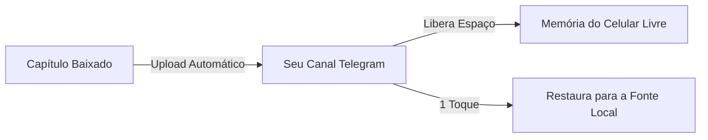

🇧🇷 Português | [🇺🇸 English](README_EN.md) | [🇪🇸 Español](README_ES.md)

# Yomotsu

### Central de Mangás, Novels e Animes com Tradução por IA para Android

*Baseado no Mihon e Anikku, com OCR avançado, tradução automática nos balões, player nativo de animes (MPV), leitor dedicado de novels e sincronização via Nuvem Telegram.*

 

 

[Recursos](#-principais-recursos) • [Animes](#-reprodução-de-animes--player-mpv) • [Motores de Tradução](#-motores-de-tradução) • [Nuvem Telegram](#-como-usar-a-nuvem-telegram) • [Download](#-download) • [Requisitos](#-requisitos) • [Créditos](#-créditos)

---

  <h3>✨ Tradução em Tempo Real nos Balões ✨</h3>
  
  
  
<i>(Exemplo real de tradução no Yomotsu: Limpeza do balão e aplicação nativa em Português)</i>

---

## 💡 Sobre o Yomotsu

O **Yomotsu** é um aplicativo Android completo para os fãs de cultura pop asiática que elimina as barreiras de idioma e fragmentação. Ele reúne em um único lugar a leitura de **mangás, manhwas, webtoons, quadrinhos, Light Novels** e a **reprodução de animes em alta definição**, combinando tecnologias de **Visão Computacional (OCR)** e **Inteligência Artificial** para traduzir diálogos e textos diretamente na tela.

Construído a partir das bases consagradas do **Mihon (Tachiyomi)** e **Anikku (Aniyomi)**, o Yomotsu oferece máxima velocidade, organização e extenso catálogo de extensões, aliado a inovações exclusivas: player de vídeo MPV com aceleração de hardware, tradução em tempo real com foco em **Português Brasileiro**, leitor fluido de novels com narração neural e backup ilimitado na **Nuvem Telegram**.

---

## 🌟 Os 4 Pilares do Yomotsu

<table>
  <tr>
    <td width="25%" align="center">
      <h3>🏮 Tradução Inteligente</h3>
      
Reconhece o texto nos balões com OCR, limpa a arte original e insere a tradução perfeitamente diagramada.

    </td>
    <td width="25%" align="center">
      <h3>🎬 Player de Animes (MPV)</h3>
      
Reprodução de vídeo acelerada por hardware (GPU), download offline, múltiplas faixas de áudio, legendas e qualidades.

    </td>
    <td width="25%" align="center">
      <h3>📖 Leitor de Light Novels</h3>
      
Modo de leitura de texto nativo com tipografia ajustável estilo Kindle, tradução de parágrafos e narração TTS.

    </td>
    <td width="25%" align="center">
      <h3>☁️ Nuvem Telegram</h3>
      
Armazenamento ilimitado no seu canal do Telegram para fazer backup de capítulos e economizar memória do celular.

    </td>
  </tr>
</table>

---

## 🚀 Principais recursos

### 🎬 Reprodução de Animes & Player MPV
* **Player Nativo MPV de Alta Performance:** Renderização acelerada por GPU garantindo reprodução lisa e baixo consumo de bateria.
* **Seleção de Qualidade e Faixas:** Escolha entre múltiplas resoluções de vídeo (1080p, 720p, etc.), faixas de áudio (dublado/legendado) e legendas embutidas ou externas.
* **Gerenciador de Downloads de Animes:** Baixe episódios completos diretamente pelo aplicativo para assistir offline onde quiser.
* **Extensões de Animes Privadas:** Aba exclusiva de Fontes e Extensões para Animes no Explorar (base Anikku/Aniyomi) instaladas de forma interna e segura.
* **Histórico e Atualizações Separados:** Controle inteligente de episódios assistidos e alertas de lançamentos de animes de forma independente de mangás.

### 🎮 Perfil Yomotsu & Sistema de Progressão
* **Perfil Yomotsu Totalmente Repaginado:** Painel completo exibindo seu progresso, nível, conquistas e patentes.
* **20 Avatares Oficiais de Personagens:** Retratos de anime em alta definição (512x512) com enquadramento circular perfeito para fotos de perfil (Gojo, Sukuna, Sung Jin-woo, Luffy, Zoro, Tanjiro, Nezuko, Naruto, Ichigo, Saitama, Eren, Levi, Frieren, Anya, Killua, Goku, Guts, Rimuru, Megumin, Alucard e Yomotsu Original).
* **20 Banners Exclusivos:** 12 cenários cinematográficos de animes (Santuário Malevolente, Castelo Infinito, Thousand Sunny, Vale do Fim, Vila da Folha, Cometa Tiamat, Céu de Tóquio, Portão das Sombras, Colina das Flores, Muralha Maria, Trilhos no Mar e Jardim Secreto) e 8 gradientes minimalistas.
* **Bordas de Rank Dinâmicas:** Molduras de avatar incluindo o Rank Dinâmico que evolui e reflete a cor da sua patente e nível de leitura no app.
* **Métricas Completas de Biblioteca & Trackers:** Estatísticas de capítulos lidos, episódios assistidos, tempo total dedicado, downloads offline, obras concluídas e integração com serviços de rastreamento (AniList, MyAnimeList, etc.) com nota média e contagem de títulos monitorados.
* **Conquistas Temáticas:** Desafios e conquistas para desbloquear conforme você consome mangás, novels e animes.

### 📖 Leitura e Visualização de Mangás & Novels
* **Suporte Completo a Obras:** Leia mangás, manhwas, webtoons, quadrinhos e **Light Novels / Webnovels**.
* **Leitor Dedicado de Novels:** Modo texto imersivo com tipografia ajustável (fontes, tamanho de letra, espaçamento entre linhas e margens personalizadas) e narração neural ultra-realista.
* **Modos de Imagem Avançados:** Modos de página simples, página dupla invertida e webtoon com rolagem vertical contínua.
* **Organização Total:** Biblioteca com categorias personalizadas, histórico de leitura sincronizado, rastreadores e downloads locais.
* **Interface Moderna:** Suporte completo a temas claro, escuro e dinâmico (Material You).

### 🌐 OCR e Tradução Automática com IA

  
  
  
  
<i>Painéis de customização avançada: suporte nativo a Qwen, OpenRouter, PaddleOCR e Telegram.</i>

* **Tradução sem sair do leitor:** Traduza páginas inteiras ou capítulos completos com apenas um toque.
* **OCR de Alta Precisão:** Reconhecimento óptico de caracteres nos idiomas inglês, japonês, coreano e chinês.
* **Múltiplos Provedores:** Escolha entre motores locais (sem gastar internet) e provedores de IA de última geração.
* **Inpainting & Diagramação:** Apagamento do texto original e adaptação automática do tamanho da fonte para caber no balão.
* **Glossário Contextual:** Memória por obra para manter nomes de personagens, golpes e termos traduzidos de forma consistente.
* **Ajuste Manual:** Toque em qualquer balão para editar a tradução ou solicitar retradução individual instantaneamente.

### ☁️ Nuvem Telegram (Backup & Economia de Armazenamento)
* **Backup no Telegram:** Envie capítulos de mangás e novels diretamente para o seu supergrupo ou canal privado.
* **Economia de Espaço no Celular:** Apague os arquivos locais automaticamente após o upload confirmado na nuvem.
* **Restauração em 1 Toque:** Baixe qualquer capítulo ou obra completa da nuvem diretamente para a Fonte Local a qualquer momento.
* **Gerenciador Integrado:** Visualize todas as obras salvas na nuvem, consulte capítulos e realize exclusões diretas.
* **Sincronização Inteligente:** Catálogo que detecta e remove apenas os capítulos que foram realmente apagados do Telegram, mantendo todas as suas obras seguras.

---

## 📊 Motores de Tradução

O Yomotsu oferece flexibilidade total para você escolher como traduzir suas leituras:

| Motor | Tipo | Chave de API | Idiomas Suportados | Vantagens |
| :--- | :---: | :---: | :---: | :--- |
| **ML Kit (Google)** | No dispositivo | ❌ Não precisa | EN, JA, KO, ZH | **100% Offline e Instantâneo** — Não consome franquia de internet. |
| **Google Tradutor** | Nuvem | ❌ Não precisa | Dezenas de idiomas | **Sem configuração** — Pronto para usar imediatamente. |
| **DeepL** | Nuvem (API) | 🔑 Necessária | EN, JA, ZH | **Fluidez Extrema** — Traduções gramaticais e naturais de alto nível. |
| **Google Gemini** | IA Generativa | 🔑 Gratuita | Todos os idiomas | **Compreensão Contextual** — Entende gírias, piadas e contexto narrativo. |
| **OpenRouter** | IA Multimodelo | 🔑 Necessária | Todos os idiomas | **Liberdade Total** — Conecte a modelos como Claude, GPT-4, Llama e outros. |

---

## ☁️ Como Usar a Nuvem Telegram

O Yomotsu utiliza a infraestrutura do Telegram para fornecer backup ilimitado e leitura 100% em nuvem (streaming) para seus mangás e novels:

### Passo a Passo de Configuração:
1. **Crie um Canal ou Supergrupo Privado** no Telegram onde os arquivos serão armazenados.
2. Abra o Telegram e converse com o **[@BotFather](https://t.me/BotFather)**:
   * Envie `/newbot`, escolha um nome e usuário para o seu bot.
   * Copie o **Token de Acesso** gerado (ex: `123456789:ABCdef...`).
3. Adicione o seu bot como **Administrador** do seu canal com permissão de postar mensagens.
4. Pegue o **ID do Canal** (você pode encaminhar uma mensagem do canal para o bot `@userinfobot` ou `@RawDataBot` para obter o ID numérico, geralmente começando com `-100`).
5. No Yomotsu, abra **Mais > Configurações > Nuvem Telegram**:
   * Ative a opção **Nuvem Telegram**.
   * Cole o **Token do Bot** e o **ID do Chat/Canal**.
   * *(Opcional)* Ative **Excluir arquivos locais após upload** para poupar espaço interno!

> [!TIP]
> **Leitura 100% na Nuvem (Streaming):** Você não precisa baixar os capítulos de volta para o celular para ler! O Yomotsu possui uma Fonte nativa do Telegram que permite ler mangás e novels diretamente da nuvem, poupando 100% do seu armazenamento interno.

---

## 📥 Download

A versão oficial mais recente pronta para instalação está sempre disponível em:

### [👉 Baixar a Última Versão do Yomotsu (APK)](https://github.com/kiritsuguxs/yomotsu/releases/latest)

* O arquivo principal é o **`Yomotsu-*-arm64.apk`** (otimizado para praticamente todos os celulares modernos).
* Instalações subsequentes funcionam como atualização direta por cima da versão existente, sem perda de biblioteca ou dados.

---

## ⚙️ Requisitos

* **Sistema Operacional:** Android 8.0 (Oreo) ou superior.
* **Permissões:** Acesso a notificações (para status de downloads e backups) e armazenamento.
* **Conexão:** Para os tradutores de IA na nuvem (DeepL, Gemini, OpenRouter) e para a Nuvem Telegram, é necessária conexão com a internet.

---

## ⚖️ Aviso Legal

O Yomotsu é um software de código aberto e sem fins lucrativos, desenvolvido exclusivamente como um leitor de arquivos locais e cliente de integração pessoal de nuvem. **O Yomotsu não hospeda, não distribui e não possui afiliação com serviços que fornecem materiais protegidos por direitos autorais.** O aplicativo não inclui extensões ou catálogos de obras. O usuário é o único responsável por todo o conteúdo que insere, traduz ou faz backup usando esta ferramenta.

---

## 🤝 Créditos e Agradecimentos

O Yomotsu é fruto do esforço da comunidade open source:
* **[Mihon / Tachiyomi](https://github.com/mihonapp/mihon)** — A base e arquitetura que tornam este leitor tão estável e completo.
* **[Anikku / Aniyomi](https://github.com/aniyomiorg/aniyomi)** — Ecossistema e arquitetura pioneira de suporte a animes e extensões.
* **[MPV Android](https://github.com/mpv-android/mpv-android)** — Motor de reprodução de vídeo leve, potente e com aceleração gráfica.
* **[FFmpegKit](https://github.com/arthenica/ffmpeg-kit)** — Processamento e manipulação de fluxos de mídia e downloads seguros.
* **[TDLib (Telegram Database Library)](https://github.com/tdlib/td)** — Motor que viabiliza a integração nativa e robusta com o Telegram.
* **[Google ML Kit](https://developers.google.com/ml-kit)** — Reconhecimento e visão computacional em tempo real no dispositivo.
* A todos os desenvolvedores e tradutores que apoiam o ecossistema de leitura livre no Android.

---

  Yomotsu Oficial • Desenvolvido com foco na melhor experiência de leitura em Português Brasileiro.

