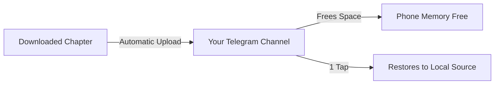

[🇧🇷 Português](README.md) | 🇺🇸 English | [🇪🇸 Español](README_ES.md)

# Yomotsu

### AI-Translated Manga, Light Novel, and Anime Hub for Android

*Based on Mihon and Anikku, featuring advanced OCR, automatic bubble translation, native anime player (MPV), dedicated novel reader, and Telegram Cloud synchronization.*

 

 

[Features](#-main-features) • [Anime](#-anime-playback--mpv-player) • [Translation Engines](#-translation-engines) • [Telegram Cloud](#%E2%98%81%EF%B8%8F-how-to-use-telegram-cloud) • [Download](#-download) • [Requirements](#%E2%9A%99%EF%B8%8F-requirements) • [Credits](#-credits-and-acknowledgments)

---

  <h3>✨ Real-Time Bubble Translation ✨</h3>
  
  
   
  
<i>(Example: English to Portuguese. <b>Note: Yomotsu translates from ANY language (Raw Japanese, Korean, etc.) to ANY target language you want!</b>)</i>

---

## 💡 About Yomotsu

**Yomotsu** is an all-in-one Android media hub that breaks down language and ecosystem barriers. It brings the reading of **mangas, manhwas, webtoons, comics, and Light Novels** together with **high-definition anime streaming and offline playback** into a single application, combining **Computer Vision (OCR)** and **Artificial Intelligence** technologies to translate dialogue directly on your screen.

Built on top of the celebrated foundations of **Mihon (Tachiyomi)** and **Anikku (Aniyomi)**, Yomotsu delivers lightning speed, impeccable organization, and a vast extensions catalog, enhanced with exclusive features: hardware-accelerated MPV video player, real-time bubble translation, neural novel TTS narration, and unlimited **Telegram Cloud backup**.

---

## 🌟 The 4 Pillars of Yomotsu

<table>
  <tr>
    <td width="25%" align="center">
      <h3>🏮 Smart Translation</h3>
      
Recognizes text inside bubbles using OCR, cleans original artwork, and inserts translated text with automated typesetting.

    </td>
    <td width="25%" align="center">
      <h3>🎬 Anime Player (MPV)</h3>
      
GPU-accelerated video playback, offline episode downloads, multi-audio tracks, embedded/external subtitles, and quality selection.

    </td>
    <td width="25%" align="center">
      <h3>📖 Light Novel Reader</h3>
      
Immersive text reading mode with Kindle-like typography, paragraph translation, and ultra-realistic neural TTS narration.

    </td>
    <td width="25%" align="center">
      <h3>☁️ Telegram Cloud</h3>
      
Unlimited cloud storage in your Telegram channel to backup chapters and free up local device storage.

    </td>
  </tr>
</table>

---

## 🚀 Main features

### 🎬 Anime Playback & MPV Player
* **High-Performance Native MPV Player:** Hardware-accelerated GPU rendering delivering smooth playback with minimal battery drain.
* **Quality & Track Selection:** Seamlessly switch between video qualities (1080p, 720p, etc.), multi-language audio tracks, and embedded or external subtitles.
* **Anime Download Manager:** Download full anime episodes directly within the app for offline viewing anywhere.
* **Private Anime Extensions:** Dedicated Anime Sources and Extensions tab in Explore (powered by Anikku/Aniyomi ecosystem), installed internally and securely.
* **Independent History & Updates:** Separate progress tracking for watched episodes and anime release notifications independent of manga.

### 🎮 Yomotsu Profile & Progression
* **Completely Revamped Profile:** Full dashboard showcasing your progress, rank level, unlocked achievements, and badges.
* **20 Official Character Avatars:** High-definition character portraits (512x512) framed perfectly for circular profile pictures (Gojo, Sukuna, Sung Jin-woo, Luffy, Zoro, Tanjiro, Nezuko, Naruto, Ichigo, Saitama, Eren, Levi, Frieren, Anya, Killua, Goku, Guts, Rimuru, Megumin, Alucard, and Yomotsu Original).
* **20 Exclusive Banners:** 12 breathtaking widescreen anime landscapes (Malevolent Shrine, Infinity Castle, Thousand Sunny, Valley of the End, Hidden Leaf Village, Tiamat Comet, Tokyo Sky, Shadow Gate, Flower Hill, Wall Maria, Spirited Away Sea Train, and Howl's Secret Garden) plus 8 sleek minimalist gradients.
* **Dynamic Rank Borders:** Exclusive avatar borders, including a Dynamic Rank border that automatically reflects your reading rank and progression color.
* **Full Library Metrics & Tracker Sync:** In-depth statistics for chapters read, episodes watched, total time spent, offline downloads, completed titles, and full tracker sync (AniList, MyAnimeList, etc.) with tracked title counts and universal average score.
* **Themed Anime Achievements:** Unlockable challenges across manga reading, novel exploration, and anime watching.

### 📖 Manga & Novel Reading
* **Full Title Support:** Read mangas, manhwas, webtoons, comics, and **Light Novels / Webnovels**.
* **Dedicated Novel Reader:** Immersive text mode with adjustable typography (fonts, letter size, line spacing, custom margins) and neural audio narration.
* **Advanced Image Modes:** Single page, inverted double page, and webtoon modes with continuous vertical scrolling.
* **Total Organization:** Library with custom categories, synchronized reading history, trackers, and local downloads.
* **Modern Interface:** Full support for light, dark, and dynamic themes (Material You).

### 🌐 OCR and AI Automatic Translation

  
  
  
  
<i>Advanced customization panels: native support for Qwen, OpenRouter, PaddleOCR, and Telegram.</i>

* **Translate without leaving the reader:** Translate entire pages or full chapters with just one tap.
* **High Precision OCR:** Optical character recognition for English, Japanese, Korean, and Chinese.
* **Multiple Providers:** Choose between local engines (without consuming internet data) and next-gen AI providers.
* **Inpainting & Typesetting:** Erasure of original text and automatic font size adaptation to fit the bubble.
* **Contextual Glossary:** Per-series memory to keep character names, attacks, and terms translated consistently.
* **Manual Adjustment:** Tap any bubble to instantly edit the translation or request an individual re-translation.

### ☁️ Telegram Cloud (Backup & Storage Saving)
* **Telegram Backup:** Send manga and novel chapters directly to your supergroup or private channel.
* **Save Phone Space:** Automatically delete local files after a confirmed cloud upload.
* **1-Tap Restore:** Download any chapter or full series from the cloud directly back to the Local Source at any time.
* **Integrated Manager:** View all series saved in the cloud, check chapters, and perform direct deletions.
* **Smart Sync:** Catalog that detects and removes only chapters that were actually deleted from Telegram, keeping all your series safe.

---

## 📊 Translation Engines

Yomotsu offers total flexibility for you to choose how to translate your readings:

| Engine | Type | API Key | Supported Languages | Advantages |
| :--- | :---: | :---: | :---: | :--- |
| **ML Kit (Google)** | On-device | ❌ Not needed | EN, JA, KO, ZH | **100% Offline & Instant** — Consumes no data. |
| **Google Translate** | Cloud | ❌ Not needed | Dozens of languages | **No setup** — Ready to use immediately. |
| **DeepL** | Cloud (API) | 🔑 Required | EN, JA, ZH | **Extreme Fluency** — High-level grammatical and natural translations. |
| **Google Gemini** | Generative AI | 🔑 Free | All languages | **Contextual Understanding** — Understands slang, jokes, and narrative context. |
| **OpenRouter** | Multi-model AI | 🔑 Required | All languages | **Total Freedom** — Connect to models like Claude, GPT-4, Llama, and others. |

---

## ☁️ How to Use Telegram Cloud

Yomotsu uses Telegram's infrastructure to provide unlimited backup and 100% cloud reading (streaming) for your mangas and novels:

### Setup Step-by-Step:
1. **Create a Private Channel or Supergroup** on Telegram where files will be stored.
2. Open Telegram and chat with **[@BotFather](https://t.me/BotFather)**:
   * Send `/newbot`, choose a name and username for your bot.
   * Copy the generated **Access Token** (e.g., `123456789:ABCdef...`).
3. Add your bot as an **Administrator** of your channel with permission to post messages.
4. Get the **Channel ID** (you can forward a message from the channel to the `@userinfobot` or `@RawDataBot` bot to get the numeric ID, usually starting with `-100`).
5. In Yomotsu, open **More > Settings > Telegram Cloud**:
   * Enable the **Telegram Cloud** option.
   * Paste the **Bot Token** and the **Chat/Channel ID**.
   * *(Optional)* Enable **Delete local files after upload** to save internal space!

> [!TIP]
> **100% Cloud Reading (Streaming):** You don't need to download chapters back to your phone to read them! Yomotsu has a native Telegram Source that allows reading mangas and novels directly from the cloud, saving 100% of your internal storage.

---

## 📥 Download

The latest official version ready for installation is always available at:

### [👉 Download Latest Yomotsu Release (APK)](https://github.com/kiritsuguxs/yomotsu/releases/latest)

* The main file is **`Yomotsu-*-arm64.apk`** (optimized for almost all modern phones).
* Subsequent installations work as direct updates over the existing version, without losing your library or data.

---

## ⚙️ Requirements

* **OS:** Android 8.0 (Oreo) or higher.
* **Permissions:** Access to notifications (for download and backup statuses) and storage.
* **Connection:** Internet connection required for cloud AI translators (DeepL, Gemini, OpenRouter) and Telegram Cloud.

---

## ⚖️ Legal Disclaimer

Yomotsu is an open-source, non-profit software developed exclusively as a local file reader and personal cloud integration client. **Yomotsu does not host, distribute, or have any affiliation with services that provide copyrighted materials.** The application does not include extensions or catalogs of works. The user is solely responsible for all content they insert, translate, or backup using this tool.

---

## 🤝 Credits and Acknowledgments

Yomotsu is the result of the open-source community's effort:
* **[Mihon / Tachiyomi](https://github.com/mihonapp/mihon)** — The base and architecture that make this reader so stable and complete.
* **[Anikku / Aniyomi](https://github.com/aniyomiorg/aniyomi)** — Pioneering ecosystem and architecture for anime support and media extensions.
* **[MPV Android](https://github.com/mpv-android/mpv-android)** — Lightweight, feature-packed hardware-accelerated video player core.
* **[FFmpegKit](https://github.com/arthenica/ffmpeg-kit)** — Robust media stream handling and secure video downloading.
* **[TDLib (Telegram Database Library)](https://github.com/tdlib/td)** — Engine that enables native and robust integration with Telegram.
* **[Google ML Kit](https://developers.google.com/ml-kit)** — Real-time on-device optical character recognition and computer vision.
* To all developers and translators who support the free reading ecosystem on Android.

---

  Yomotsu Official • Developed focusing on the best reading experience.

